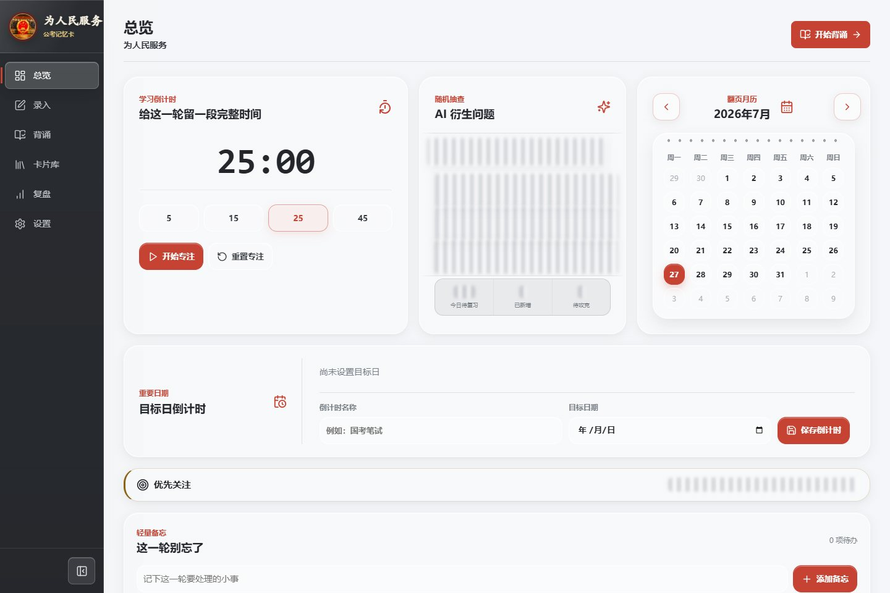
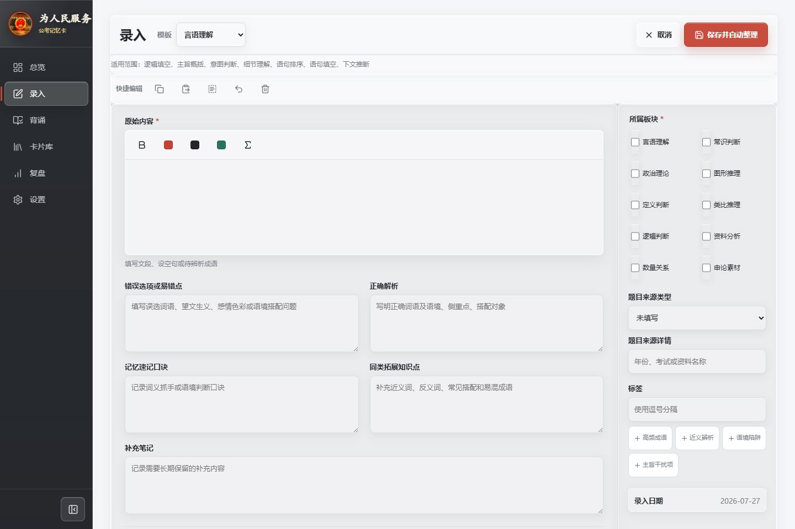
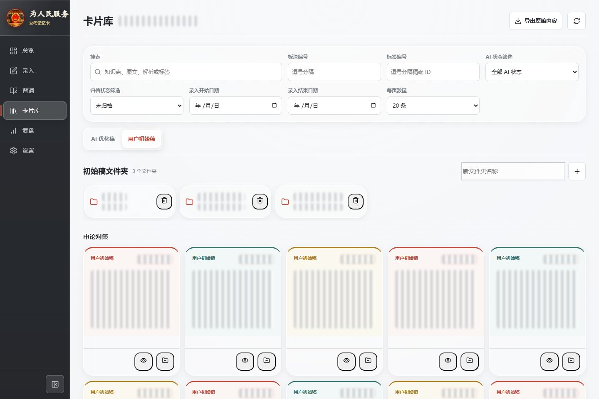
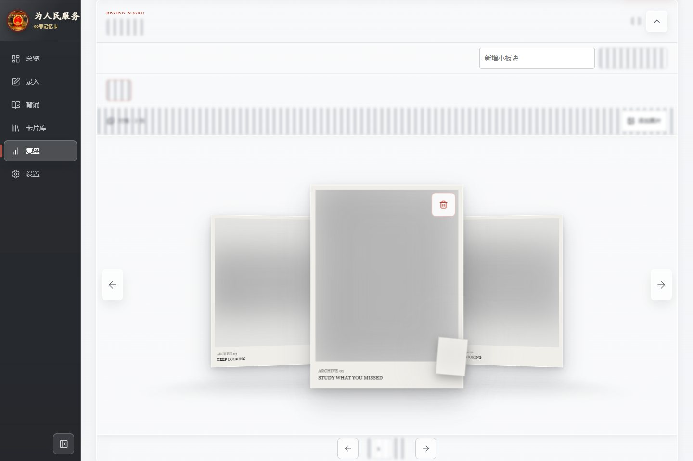
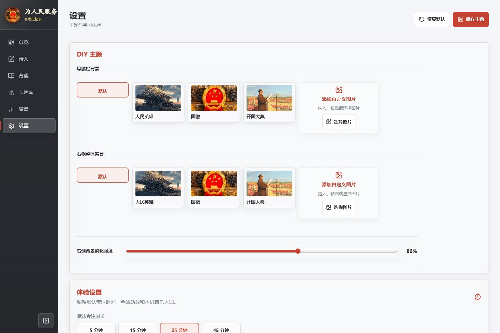
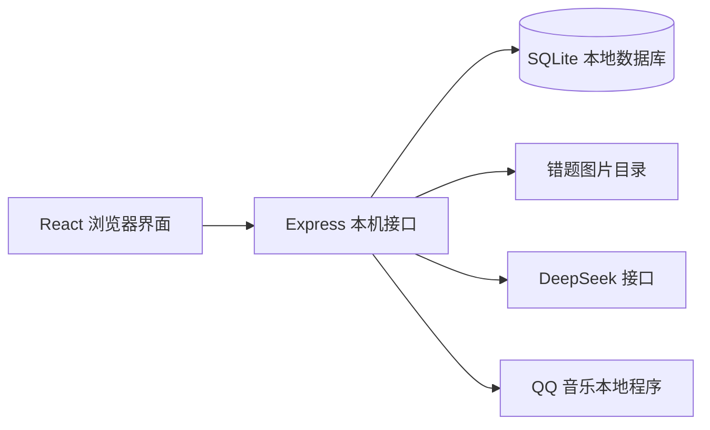

# 公考记忆卡

一套本机运行的公考学习工作台，将资料录入、AI 整理、卡片背诵、初始稿管理和错题图片复盘集中在同一个系统中。项目采用本地优先的数据方案：卡片、复习记录和错题图片保存在当前电脑，DeepSeek 密钥只从本机环境变量读取。

> 截图来自真实运行界面。卡片正文、AI 题面、答案、错题图片、文件夹名称、统计数量和本机配置均已在截图生成阶段直接打码，仓库中的图片文件不包含可辨认的个人学习内容。

## 功能总览

| 模块 | 主要能力 |
| --- | --- |
| 总览 | 专注倒计时、AI 衍生问题弹幕、翻页月历、目标日倒计时、薄弱项提示和轻量备忘 |
| 录入 | 富文本原始资料、红色与加粗标记、公式整理、图片粘贴或拖入、DeepSeek 自动衍生题目 |
| 背诵 | 封面选题、板块与日期范围、实时题量、3D 摇杆抽题、键盘快捷操作和初始稿随机抽查 |
| 卡片库 | AI 优化稿与用户初始稿切换、模糊搜索、文件夹、拖拽归类、手动排序、归档和 Excel 导出 |
| 复盘 | 多级错题图集、图片拖入或粘贴、3D 轮播、放大查看、页码跳转、板块排序与归档 |
| 设置 | DIY 双区域背景、液态玻璃动效、减少动态效果、默认学习参数、QQ 音乐和本地备份 |

## 界面预览

### 总览

总览页把每天最常用的信息集中到一个工作台：专注倒计时离开页面后继续按真实时间运行；AI 衍生问题以随机弹幕形式滚动；月历使用翻页动效；目标日期、薄弱板块和备忘事项可以随时查看。



### 录入

录入页支持结构化模板和富文本输入，可保留红色、加粗等重点格式。图片既可以从资源管理器选择，也可以直接从微信、QQ 或剪贴板拖入、粘贴；保存时可调用 DeepSeek 整理内容、规范公式并衍生背诵问题。



### 背诵

背诵从开国大典封面开始，先按大板块、小板块和录入日期选择范围，匹配题量会立即刷新，但只有点击“开始背诵”后才进入题目。3D 摇杆负责随机抽取数量，抽取结束后仍由用户主动开始。


背诵过程支持：

- `空格` 查看或收起答案，`←`、`→` 切换上一张和下一张；
- `Y` 标记记住，`N` 标记不会；标记记住后自动进入下一题；
- 按板块和日期限定普通题面或用户初始稿的抽查范围；
- 初始稿使用扑克牌抽取动效，并可分别记录记住和没记住；
- 完成本轮后回到封面，避免无意开始下一轮。

### 卡片库

卡片库以独立小卡片展示内容，可以在“AI 优化稿”和“用户初始稿”之间切换。初始稿按一次输入合并展示，避免同一资料衍生多个问题后重复占位；预览从页面底部弹出，既能查看格式化原文，也能查看 AI 问题和答案。



卡片管理支持：

- 按正文、知识点、解析或标签进行模糊搜索，并组合板块、标签、日期、归档和 AI 状态筛选；
- 新输入内容默认排在现有卡片之前，之后可手动置顶、置底或调整顺序；
- 新建和删除初始稿文件夹，将卡片拖入文件夹时保留原卡片，相当于建立一份引用；
- 在卡片上显示已加入的文件夹，也可以只从某个文件夹移除，避免误加；
- 编辑用户初始稿并重新衍生问题；
- 归档、恢复和彻底删除归档内容；
- 导出用户原始内容到 Excel，并按大板块分别写入不同工作表。

### 错题复盘

复盘页用白色立体卡片轮播组织错题图片。中心图片最大，两侧卡片按景深缩小；支持按钮、键盘和页码切换，点击图片后可放大查看。截图中的错题图片已经灰阶强模糊处理。



错题积累支持：

- 自定义大板块和小板块，并对两级板块分别排序、隐藏、归档和恢复；
- 每个大板块独立收起或展开，小板块支持输入页码快速跳转；
- 从微信、QQ、剪贴板或资源管理器直接拖入、粘贴图片；
- 图片按“板块 + 时间”自动重命名，并存入对应小板块目录；
- `manifest.json` 保存稳定编号和分类关系，新增板块时自动创建目录；
- 单图放大、缩放、删除，以及整板块的独立图集管理。

### 设置与主题

设置页可以分别配置导航栏背景和内容区背景。内置人民英雄、国徽、开国大典三套素材，也可以拖入或粘贴自定义图片；选择结果保存在当前浏览器，下次启动会自动恢复。



界面使用浅色液态玻璃层、按压反馈、可中断弹簧动画和有物理感的拖拽反馈。减少动态效果模式会缩短或关闭大幅位移、摇杆滚动和连续漂浮，保留必要的状态提示。

## 数据与隐私

默认情况下，所有业务数据都位于项目根目录的 `data/`，该目录已被 Git 忽略：

```text
data/
├─ gongkao.db                 # 卡片、复习记录、板块和应用设置
├─ review-images/             # 按大板块和小板块分目录保存的错题图片
│  └─ manifest.json           # 图片稳定编号、分类和归档状态
└─ backups/                   # 本机生成的备份文件
```

- `.env` 可能包含 `DEEPSEEK_API_KEY`，已被 Git 忽略；公开仓库只保留无密钥的 `.env.example`。
- `data/`、运行日志、临时截图、测试产物和浏览器会话均不会进入版本库。
- `public/diy/` 是项目正式内置背景资源，会随源码发布；用户自行添加的浏览器背景不会写入仓库。
- ZIP 备份包含数据库、清单和数据库实际引用的附件，不包含 `.env`、API 密钥或历史备份。

更完整的目录迁移、图片命名、备份恢复和接口说明见[本地运行与数据管理](docs/本地运行与数据管理.md)。

## 系统结构



| 层级 | 技术 |
| --- | --- |
| 前端 | React 18、TypeScript、Vite、React Router、Tiptap、Motion、Lucide |
| 服务端 | Node.js 22、Express、Zod、Multer |
| 数据 | SQLite、`better-sqlite3`、文件系统清单 |
| 记忆调度 | `ts-fsrs` |
| 验证 | Vitest、Testing Library、Supertest、Playwright |

## 快速启动

### 环境要求

- Node.js `22.12` 或更高版本；
- npm；
- Windows 可使用一键启动脚本，QQ 音乐联动也仅针对本机 Windows 程序路径。

### Windows 一键启动

双击根目录的 `启动项目.cmd`。脚本会检查环境、安装缺失依赖、从 `.env.example` 创建本机 `.env`、构建项目并打开页面。

### 开发模式

```powershell
npm install
Copy-Item .env.example .env
npm run dev
```

前端默认地址为 `http://127.0.0.1:5173`，后端健康检查地址为 `http://127.0.0.1:8787/api/health`。

### 生产模式

```powershell
npm install
npm run build
npm start
```

生产模式默认访问 `http://127.0.0.1:8787`。

如需启用 AI 整理，在本机 `.env` 中填写：

```dotenv
DEEPSEEK_API_KEY=你的本机密钥
DEEPSEEK_BASE_URL=https://api.deepseek.com
DEEPSEEK_MODEL=deepseek-v4-flash
PORT=8787
DATA_DIR=./data
```

不要把填写过真实密钥的 `.env` 提交到版本库。

## 常用命令

```powershell
npm run dev        # 启动开发服务
npm run typecheck  # 检查前后端类型
npm run test       # 运行单元与接口测试
npm run build      # 构建前端和服务端
npm start          # 启动生产版本
```

## 项目目录

```text
├─ src/                 # React 页面、组件、主题和交互动效
├─ server/              # 本机接口、SQLite、AI、图片和备份服务
├─ shared/              # 前后端共享数据契约
├─ tests/               # 单元、接口和组件测试
├─ public/diy/          # 随项目发布的内置主题图片
├─ docs/                # 运行、数据管理和 README 截图
├─ data/                # 本机数据，不进入版本库
├─ .env.example         # 无密钥的环境变量模板
└─ 启动项目.cmd         # Windows 一键启动入口
```

## 发布前检查

提交或公开项目之前，建议执行：

```powershell
npm run typecheck
npm run test
npm run build
git status --short
```

确认变更中不存在 `.env`、`data/`、真实卡片正文、错题原图或其他本机生成物后再推送。
